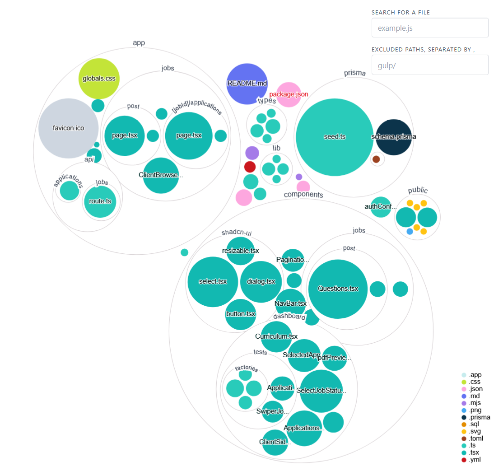

# FindAJob

findAJob is a modern, full-stack job board platform inspired by Glassdoor and similar services, where employers can post job openings and candidates can easily browse and apply.

## Features


### Core Job Board Functionality
- **Post job openings** — Employers can create, edit, and manage job listings with essential details.
- **Browse and search jobs** — Candidates can view all available positions with **pagination** support for smooth browsing of large lists.
- **Apply to jobs** — Simple and intuitive application process; candidates can submit applications directly.
- **Application question forms** — Employers can create open or multiple choice questions to filter candidates.

### Authentication & User Management
- **Secure authentication** — Full support for login/signup via credentials, **GitHub**, and **Google** OAuth providers.
- **Role-based access** — Separate experiences for candidates (job seekers) and employers (recruiters/hiring managers).
- **Curriculum / Resume management** — Candidates can upload and manage their curriculum via Supabase Bucket (Including MIME type and Size limit).
- **Curriculum preview** - Recruiters can see the preview of the candidates' curriculums and download them.

### Developer & Deployment Friendly
- **Jest** configured for unit/integration testing
- **Docker** support via `docker-compose.yml` — easy local setup with database
- Optimized for **Vercel** deployment


### Recent Highlights
- Pagination implemented on job browsing page
- Refactored dashboard layout and components

More advanced features (filters, search bar enhancements, notifications, profile pages, company pages, etc.) are planned for future iterations.

Contributions and feature requests are very welcome!

## Tech Stack

- **Frontend**: Next.js 14, React, TypeScript
- **Styling**: Tailwind CSS, shadcn/ui
- **Backend**: Next.js API Routes
- **Database**: PostgreSQL with Prisma ORM
- **File Bucket (Curriculum)**: Supabase bucket 
- **Authentication**: NextAuth.js
- **Testing**: Jest, React Testing Library
- **Containerization**: Docker, Docker Compose

## Installation

1. Clone the repository:
```bash
git clone https://github.com/Higino-Neto/findAJob.git
cd findAJob
```

2. Install dependencies:
```bash
npm install
# or
yarn install
# or
pnpm install
```

3. Set up environment variables:
```bash
cp .env.example .env
```

Edit the `.env` file with your configuration (database URL, authentication secrets, etc.)

4. Start the database using Docker:
```bash
docker-compose up -d
```

5. Run database migrations:
```bash
npx prisma migrate dev
```

6. (Optional) Seed the database:
```bash
npx prisma db seed
```

## Running the Application

Start the development server:

```bash
npm run dev
# or
yarn dev
# or
pnpm dev
# or
bun dev
```

Open [http://localhost:3000](http://localhost:3000) in your browser to see the application.

## Testing

Run the test suite:

```bash
npm test
# or
yarn test
# or
pnpm test
```

## Project Structure




```
findAJob/
├── app/              # Next.js app directory (routes, layouts)
├── components/       # Reusable React components
├── hooks/            # Custom React hooks
├── lib/              # Utility functions and configurations
├── prisma/           # Database schema and migrations
├── public/           # Static assets
├── test/             # Test files
└── types/            # TypeScript type definitions
```


## Build for Production

Create a production build:

```bash
npm run build
npm start
```

## Contributing

1. Fork the repository
2. Create your feature branch (`git checkout -b feature/AmazingFeature`)
3. Commit your changes (`git commit -m 'Add some AmazingFeature'`)
4. Push to the branch (`git push origin feature/AmazingFeature`)
5. Open a Pull Request

## Author

**Higino Neto**

- GitHub: [@Higino-Neto](https://github.com/Higino-Neto)

## Acknowledgments

- Built with [Next.js](https://nextjs.org/)
- UI components from [shadcn/ui](https://ui.shadcn.com/)
- Database management with [Prisma](https://www.prisma.io/)
- Styled with [Tailwind CSS](https://tailwindcss.com/)

---

If you found this project helpful, please consider giving it a star!
